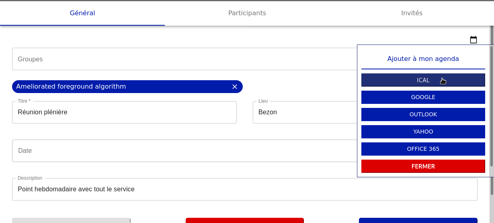
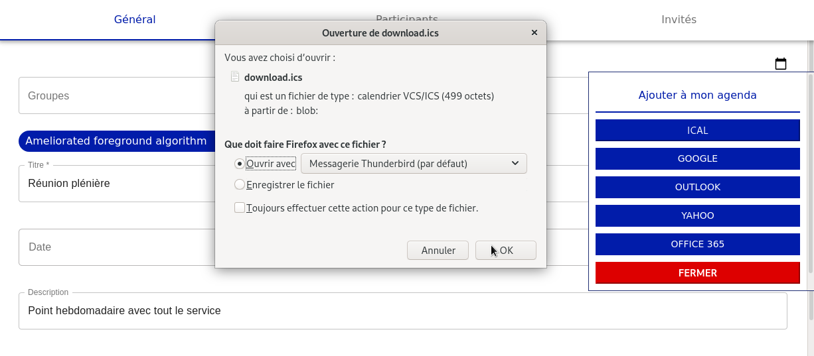
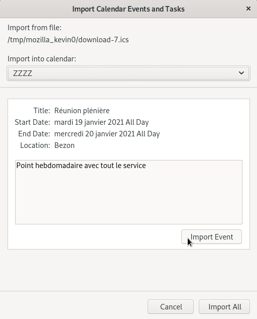
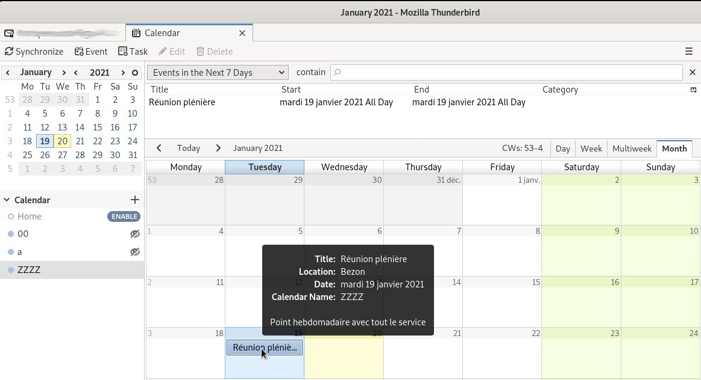

# Export un événement (ical) vers thunderbird

Il est possible d'exporter un événement vers un logciel comme **Thunderbird**. Pour cela, la procédure sera la suivante

 
## Editer un événement

Vous sélectionnez un événement pour l'éditer, puis vous cliquez sur `Ajouter à mon agenda`.

Choisir la ligne `Ical`

## Choisir l'application

Vous pouvez ouvrir l'événement directement dans une application comme **Thunderbird**. Vous effectuez les opérations suivantes :

- Sélectionnez `Ouvrir avec`
- Sélectionnez le calendrier, ici `Thunderbird`
- Puis `Ok`

## Sélection du calendrier destination

Une nouvelle fenêtre apparait pour choisir le calendrier dans votre outil de messagerie.

L'image montre trois calendriers : `00`, `a`, `ZZZZ` 

Nous choisissons l'événement `ZZZZ

## Confirmation

Après la sélectionn, il faut confirmer notre choix en cliquant sur  `Import Event`

## 5 Calendrier du logiciel

Nous ouvrons le calendrier de notre messagerie à partir du logiciel, ici `thunderbird`

L'événement s’est rajouté dans notre calendrier `ZZZZ`

